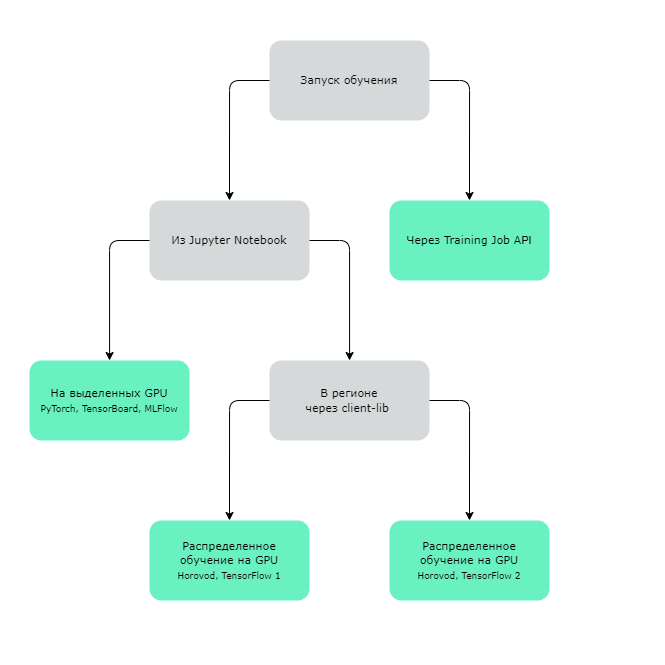

# Знакомство с платформой ML Space от Cloud.ru

В этом разделе приведены примеры создания и отправки задач для распределенного обучения моделей.

На схеме примеры сгруппированы по инструментам для обучения. Ниже находятся ссылки на каждый пример для Jupyter Notebook с кратким описанием. 

Подробнее об использовании API ML Space, в том числе для задач обучения — в [быстром старте по API](../public-api-example/ml_space_public_api.ipynb) и [пользовательской документации](https://cloud.ru/ru/docs/aicloud/mlspace/concepts/api.html).

## 1. Обучение напрямую на выделенных GPU

При таком варианте обучения максимальное количество выделенных GPU — 16. Подходит для пользователей, не знакомых с библиотекой Horovod.

Оплата взимается, пока Jupyter Server не будет удален, даже если он не используется.

* [Обучение модели в Jupyter Server](notebooks_gpu) показывает, как обучать модель напрямую из Jupyter Notebook, подключенного к GPU, задействуя `Pytorch`, `Tensorboard` и `MLFlow`.

  В примере решается задача классификации на учебном датасете MNIST.

Подробнее о создании Jupyter Server — в [документации](https://cloud.ru/ru/docs/aicloud/mlspace/concepts/guides/guides__jupyter/environments__environments__jupyter-server__create-new-jupyter-server.html).

## 2. Обучение в регионе с помощью `client-lib` 

При таком варианте обучения можно задействовать до 1000 GPU. Оплата происходит за фактическое время исполнения задачи: от старта до окончания обучения.

* [Обучение модели на GPU с применением Tensorflow 1](job_launch) показывает, как создать и запустить задачу распределенного обучения (training job) на `Horovod` и `TensorFlow 1`.

  В примере решается задача классификации на учебном датасете MNIST.

* [Обучение модели на GPU с применением Tensorflow 2](job_launch_tf2) показывает, как создать и запустить задачу распределенного обучения (training job) на `Keras`, `Horovod` и `TensorFlow 2`.

  В примере решается задача классификации на учебном датасете MNIST.

* [Обучение модели на CPU](job_launch_cpu) показывает, как создать и запустить задачу, не требующую GPU.

  В примере решается задача предсказания цен домов.

Подробнее о работе с `client-lib` — в [документации](https://cloud.ru/ru/docs/aicloud/mlspace/concepts/client-lib.html).
